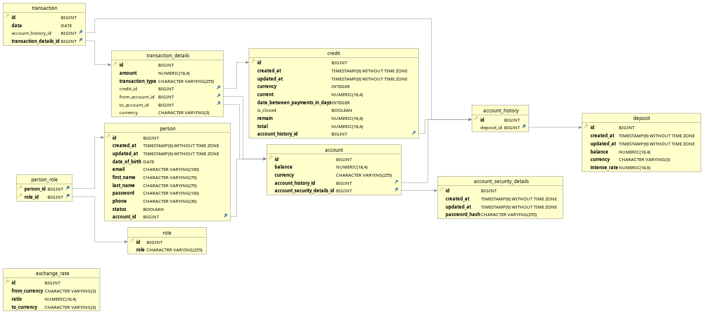

# Banking System App<hr>

## Before installation

To start the project, you need to install docker and docker-compose. You should also check if you have at least JRE 11
and, if not, install it.

Docker Install: https://docs.docker.com/engine/install/

JRE install: https://docs.oracle.com/goldengate/1212/gg-winux/GDRAD/java.htm#BGBFHBEA

## How to install

Dev:

1 Way: Change string to 'dev' on 3 row in [application.yml](src/main/resources/application.yml)

```
# docker-compose up

# ./mvnw clean spring-boot:run
```

2 Way: Run docker with arg '--profile dev'

```
# docker-compose --profile dev up

# ./mvnw clean spring-boot:run
```

Prod:

1 Way: Change string to 'prod' on 3 row in [application.yml](src/main/resources/application.yml)

```
# ./mvnw clean package -DskipTests

# docker-compose up
```

2 Way: Run docker with arg '--profile prod'

```
# ./mvnw clean package -DskipTests

# docker-compose --profile prod up
```

## Features

- [x] Add a profiles ('dev' and 'prod')
- [x] Add a docker-compose for db and spring boot app
- [x] Add a Spring Security
- [x] Add a Swagger Doc and UI
- [ ] Add a AOP
- [ ] Add a UI (Thymeleaf with HTML and CSS or perhaps Angular)
- [ ] Add a Makefile for simple configuration

## Entity Relationship Diagram



The diagram was automatically generated in DbVisualizer. [Link](https://www.dbvis.com/)

## Initial user credentials

email: **_admin@admin.com_**

password: _**admin42**_

## REST API

You can check endpoints in swagger http://localhost:port(8181 or 8888)/swagger-ui/

### Person

| Method | Url                                                      | Description                           | Sample Valid Request Body |
|--------|----------------------------------------------------------|---------------------------------------|---------------------------|
| GET    | api/v1/person                                            | Get all persons                       |                           |
| GET    | api/v1/person/{id}                                       | Get person by id                      |                           |
| GET    | api/v1/person/?firstname={firstname}                     | Get persons by firstname              |                           |
| GET    | api/v1/person/?lastname={lastname}                       | Get persons by lastname               |                           |
| GET    | api/v1/person/?firstname={firstname}&lastname={lastname} | Get persons by firstname and lastname |                           |
| GET    | api/v1/person/?phone={phone}                             | Get person by phone                   |                           |
| GET    | api/v1/person/?email={email}                             | Get person by email                   |                           |
| POST   | api/v1/person/                                           | Create a new person                   | [JSON](#create-person)    |
| PUT    | api/v1/person/{id}                                       | Update person by id                   | [JSON](#update-person)    |
| DELETE | api/v1/person/{id}                                       | Delete person by id                   |                           |

### Account

| Method | Url                                 | Description               | Sample Valid Request Body |
|--------|-------------------------------------|---------------------------|---------------------------|
| GET    | api/v1/account                      | Get all accounts          |                           |
| GET    | api/v1/account/{id}                 | Get account by id         |                           |
| GET    | api/v1/account/account-history/{id} | Get account history by id |                           |
| POST   | api/v1/account                      | Create a new account      | [JSON](#create-account)   |
| PUT    | api/v1/account/{id}                 | Update account by id      | [JSON](#update-account)   |
| DELETE | api/v1/account/{id}                 | Delete account by id      |                           |

### Credit

| Method | Url                | Description         | Sample Valid Request Body |
|--------|--------------------|---------------------|---------------------------|
| GET    | api/v1/credit      | Get all credits     |                           |
| GET    | api/v1/credit/{id} | Get credit by id    |                           |
| POST   | api/v1/credit      | Create a new credit | [JSON](#create-credit)    |
| PUT    | api/v1/credit/{id} | Update credit by id | [JSON](#update-credit)    |
| DELETE | api/v1/credit/{id} | Delete credit by id |                           |

### Deposit

| Method | Url                 | Description          | Sample Valid Request Body |
|--------|---------------------|----------------------|---------------------------|
| GET    | api/v1/deposit      | Get all deposits     |                           |
| GET    | api/v1/deposit/{id} | Get deposit by id    |                           |
| POST   | api/v1/deposit      | Create a new deposit | [JSON](#create-deposit)   |
| PUT    | api/v1/deposit/{id} | Update deposit by id | [JSON](#update-deposit)   |
| DELETE | api/v1/deposit/{id} | Delete deposit by id |                           |

### ExchangeRate

| Method | Url                                                                       | Description                                      | Sample Valid Request Body     |
|--------|---------------------------------------------------------------------------|--------------------------------------------------|-------------------------------|
| GET    | api/v1/exchange-rate                                                      | Get all exchange rates                           |                               |
| GET    | api/v1/exchange-rate/{id}                                                 | Get exchange rate by id                          |                               |
| GET    | api/v1/exchange-rate/?fromCurrency={fromCurrency}                         | Get exchange rates by fromCurrency               |                               |
| GET    | api/v1/exchange-rate/?toCurrency={toCurrency}                             | Get exchange rates by toCurrency                 |                               |
| GET    | api/v1/exchange-rate/?fromCurrency={fromCurrency}&toCurrency={toCurrency} | Get exchange rate by fromCurrency and toCurrency |                               |
| POST   | api/v1/exchange-rate                                                      | Create a new exchange rate                       | [JSON](#create-exchange-rate) |
| PUT    | api/v1/exchange-rate/{id}                                                 | Update exchange rate by id                       | [JSON](#update-exchange-rate) |
| DELETE | api/v1/exchange-rate/{id}                                                 | Delete exchange rate by id                       |                               |

### Transaction

| Method | Url                     | Description              | Sample Valid Request Body   |
|--------|-------------------------|--------------------------|-----------------------------|
| GET    | api/v1/transaction      | Get all transactions     |                             |
| GET    | api/v1/transaction/{id} | Get transaction by id    |                             |
| POST   | api/v1/transaction      | Create a new transaction | [JSON](#create-transaction) |
| DELETE | api/v1/transaction/{id} | Delete transaction by id |                             |

##### <a id="create-person">Create Person -> api/v1/person</a>

```json
{
  "dateOfBirth": "2002-09-17",
  "firstname": "Maxim",
  "lastname": "Vinnikov",
  "email": "vin.md@gmail.com",
  "phone": "+7 (952) 192-24-16",
  "password": "123",
  "status": true,
  "account": {
    "currency": "RUB",
    "accountSecurityDetails": {
      "passwordHash": "2331"
    }
  },
  "roles": [
    {
      "role": "ADMIN"
    }
  ]
}
```

##### <a id="update-person">Update Person -> api/v1/person</a>

```json
{
  "dateOfBirth": "2002-09-17",
  "firstname": "Maxim",
  "lastname": "Vinnikov",
  "email": "vin.md@gmail.com",
  "phone": "+7 (952) 192-24-16",
  "password": "123",
  "status": true,
  "account": {
    "currency": "EUR",
    "balance": 90000,
    "accountSecurityDetails": {
      "passwordHash": "3222"
    }
  },
  "roles": [
    {
      "role": "USER"
    },
    {
      "role": "ADMIN"
    }
  ]
}
```

##### <a id="create-credit">Create Credit -> api/v1/credit</a>

```json
{
  "total": 80000,
  "dateBetweenPaymentsInDays": 30,
  "currency": "USD",
  "accountHistoryId": 1
}
```

##### <a id="update-credit">Update Credit -> api/v1/credit</a>

```json
{
  "total": 80000,
  "current": 2000,
  "remain": 78000,
  "currency": "USD",
  "dateBetweenPaymentsInDays": 30,
  "accountHistoryId": 1,
  "isClosed": false
}
```

##### <a id="create-deposit">Create Deposit -> api/v1/deposit</a>

```json
{
  "intenseRate": 1.00123,
  "currency": "RUB",
  "accountHistoryId": 1
}
```

##### <a id="update-deposit">Update Deposit -> api/v1/deposit</a>

```json
{
  "intenseRate": 1.00169,
  "currency": "RUB",
  "accountHistoryId": 1
}
```

##### <a id="create-exchange-rate">Create ExchangeRate -> api/v1/exchange-rate</a>

```json
{
  "fromCurrency": "EUR",
  "toCurrency": "RUB",
  "ratio": 0.016
}
```

##### <a id="update-exchange-rate">Update ExchangeRate -> api/v1/exchange-rate</a>

```json
{
  "fromCurrency": "EUR",
  "toCurrency": "RUB",
  "ratio": 0.018
}
```

##### <a id="create-transaction">Create Transaction -> api/v1/transaction</a>

If the currency is different between accounts, account and deposit or account and credit, it will be automatically
converted using the existing exchange rate

1 Way: Transfer to another account. Required existing 'fromAccountId' and 'toAccountId' fields

```json
{
  "date": "2002-12-09",
  "transactionDetails": {
    "amount": 13200,
    "transactionType": "TRANSFER",
    "fromAccountId": 1,
    "toAccountId": 2
  }
}
```

2 Way: Top up yourself deposit. Required 'fromAccountId' field

```json
{
  "date": "2002-12-09",
  "transactionDetails": {
    "amount": 13200,
    "transactionType": "DEPOSIT",
    "fromAccountId": 1
  }
}
```

3 Way: Top up yourself credit. Required existing 'creditId' field

```json
{
  "date": "2002-12-09",
  "transactionDetails": {
    "amount": 13200,
    "transactionType": "CREDIT",
    "fromAccountId": 1,
    "creditId": 1
  }
}
```